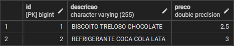
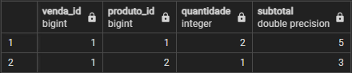
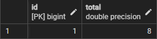

# Sistema de Vendas

## Proposta
Este programa é um sistema simples de controle de vendas, desenvolvido para atender às necessidades de comerciantes presenciais, como lojas e supermercados. Ele permite o registro de produtos e vendas, facilitando a gestão e controle financeiro das transações.

## Funcionalidades
- **Cadastro de Produtos**: Permite o registro de produtos com descrição e preço.

- **Registro de Vendas**: Possibilita a criação de vendas que podem incluir múltiplos produtos, com a respectiva quantidade e cálculo automático do total.

- **Listagem de Vendas**: Exibe todas as vendas registradas, com detalhes sobre cada produto vendido, quantidade e subtotal.

- **Cálculo Automático de Totais**: O sistema calcula automaticamente o total da venda com base nos produtos e suas quantidades.

## Ferramentas Utilizadas
- **Java**: Linguagem de programação utilizada para o desenvolvimento do sistema.

- **Spring Boot**: Framework utilizado para simplificar o desenvolvimento de aplicações Java, especialmente para gerenciamento de dependências e operações com banco de dados.

- **Spring Data JPA**: Facilita a interação com o banco de dados utilizando JPA (Java Persistence API).

- **Banco de Dados H2**: Banco de dados em memória utilizado para armazenamento das informações de produtos e vendas durante o desenvolvimento e testes.

## Resultado no SGBD

**Produtos cadastrados:**

**Detalhes de uma venda:**

**Faturamento por venda:**

## Autor
**Lucas Bomfim**  

[Visite meu LinkedIn](https://www.linkedin.com/in/lucasbomfim06/)

[Acesse meu portfólio](https://bomfimtech.vercel.app/)

## Contribuição
Contribuições são bem-vindas! Sinta-se à vontade para abrir uma issue ou enviar um pull request.

## Licença
Este projeto está licenciado sob a Licença MIT - veja o arquivo [LICENSE](LICENSE) para detalhes.
